<p align="center">
  
</p>

<h1 align="center">CareNest</h1>

<p align="center">
  <strong>Hire trusted home-care professionals in Kenya — on the web, on USSD, and with escrow you can audit.</strong>
</p>

<p align="center">
  
  
  
  
  
</p>

CareNest is a two-sided marketplace for domestic work: nannies, caregivers, housekeepers, cooks, gardeners, companions. Employers post live jobs. Workers discover them on a map, agree terms, check in, and get paid. Feature phones use the same live database over USSD. Optional Stellar escrow and a Work Passport sit under the same product — not a rewrite of it.

---

## Who uses it

| | Worker | Employer | Feature phone |
| --- | --- | --- | --- |
| **Job** | Find nearby live work, pin location, apply | Post, schedule, review applicants | Dial USSD — same jobs, same contracts |
| **Agreement** | Counter with own terms, check in / out | Offer terms, approve completion | Confirm completion / check status |
| **Money** | Wallet, M-Pesa payout, training recovery | Escrow + settlement (5% platform fee) | Contract lookup by id |
| **Proof** | Work Passport after release | Command Center + on-chain hash | Option 5 → WorkOS status |

Categories (placeholders ship with the app):

<p align="center">
  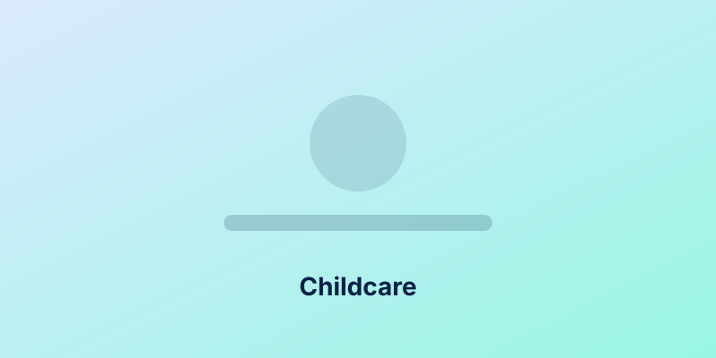
  &nbsp;
  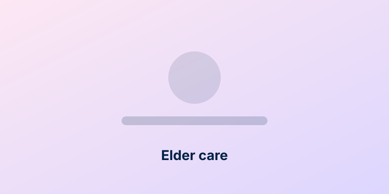
  &nbsp;
  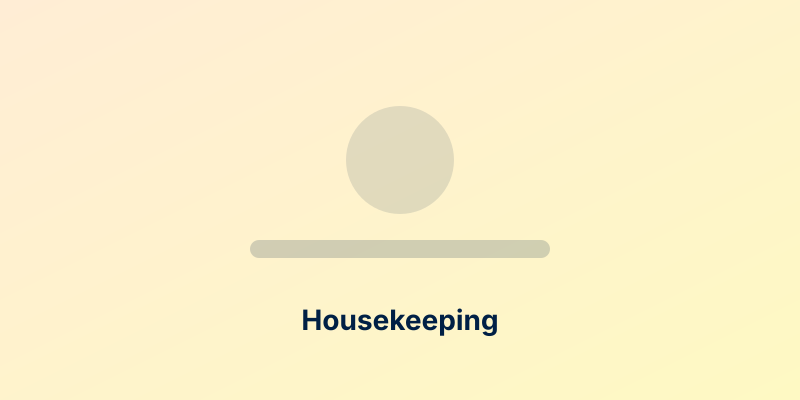
  &nbsp;
  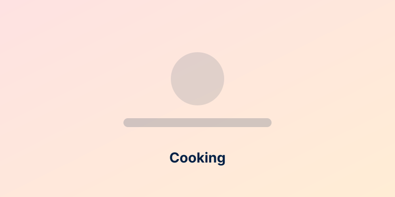
  &nbsp;
  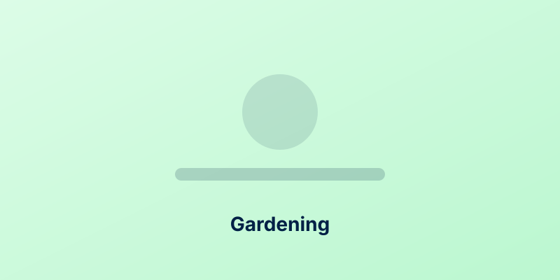
  &nbsp;
  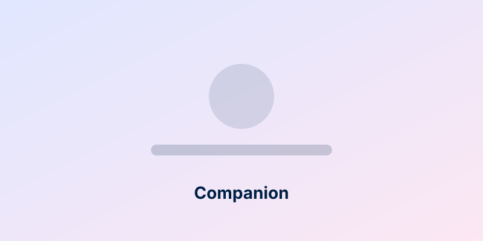
  &nbsp;
  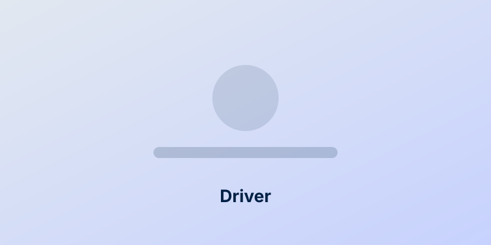
  &nbsp;
  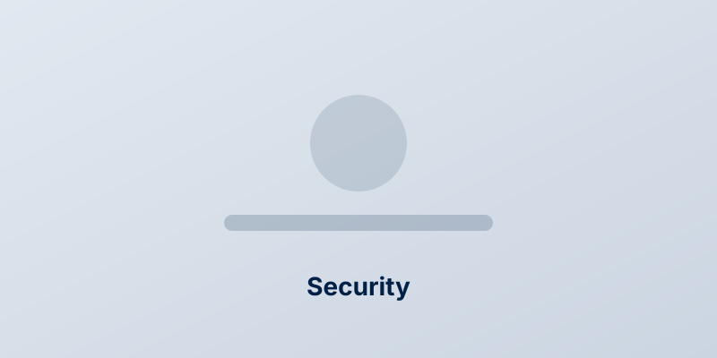
</p>

---

## How a job becomes a payout

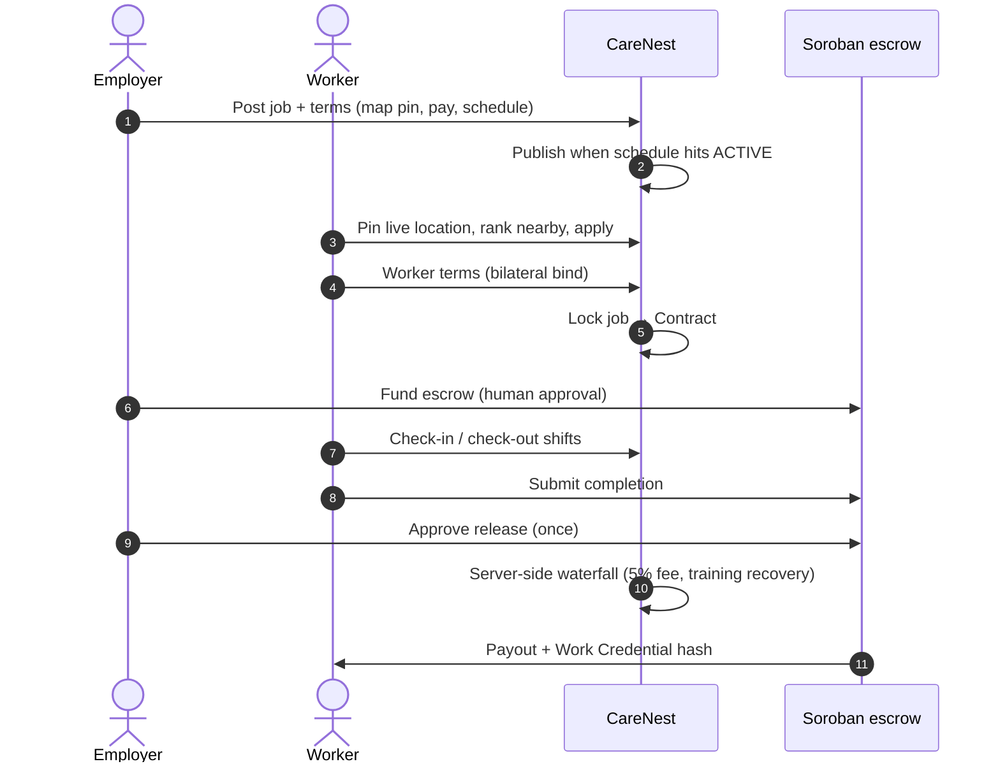

Nothing financial is trusted from the browser. Fees, recovery, and balances are computed in `apps/wallet/settlement.py`.

---

## Architecture

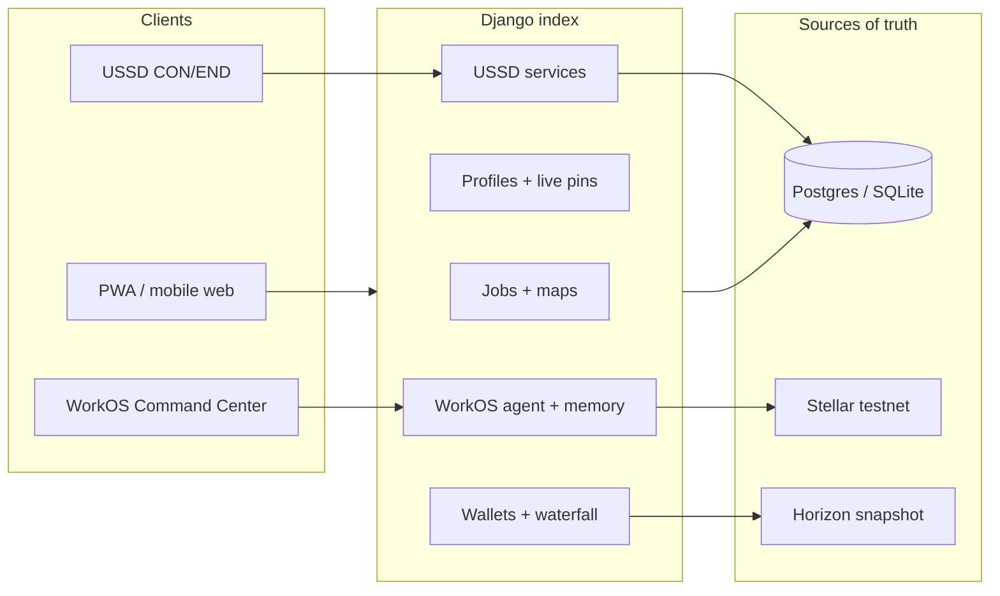

| Layer | Role |
| --- | --- |
| **Django** | Product index: users, jobs, applications, contracts, wallets, agent memory, credentials |
| **Leaflet maps** | Esri streets first; Carto Voyager if a [Basemaps API key](https://carto.com/basemaps/apikey/) is set; OSM Germany / OSM.org as fallback |
| **USSD** | Africa's Talking `CON` / `END`. Phone matched on last 9 digits of `+254…` |
| **Omega / ASI** | Parse employer language and phrase known facts. Never decides money or state |
| **Soroban `WorkContract`** | Escrow state machine. Fund and release each happen at most once |
| **Work Passport** | Completed-work hash on-chain. Workers are not tokenized |

Personal data (names, phones, IDs) stays off-chain. On-chain: wallet addresses, engagement ids, hashes, statuses, timestamps.

---

## Money: payout waterfall

Employer-facing UI shows gross pay and the **5%** platform fee only. The **20%** upskilling recovery is a worker-side training repayment, capped at remaining course balance.

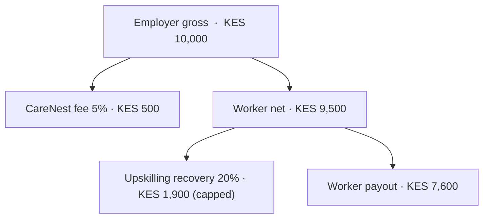

Invariants (enforced server-side): `gross = fee + worker_net` and `worker_net = payout + recovery`.

---

## On-chain engagement lifecycle

One Soroban contract instance holds many engagements. Invalid transitions are rejected; every success emits an event Django can ingest.

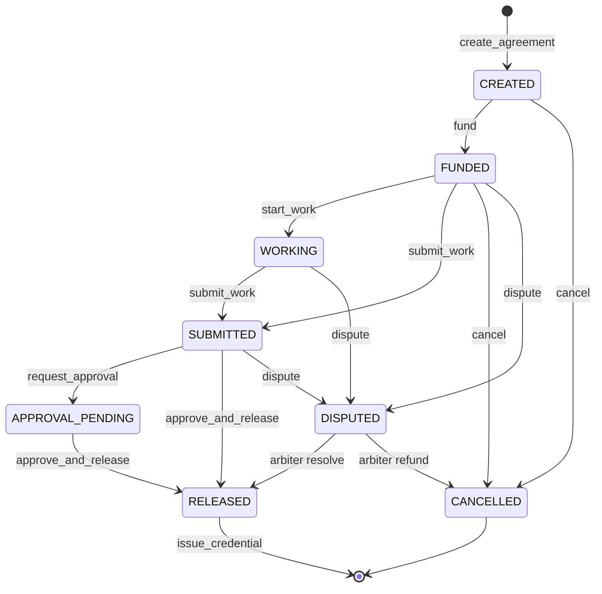

The agent may **prepare** fund / release / dispute. A human must approve. The agent never signs a financial call on its own (`apps/agentic_core/policies.py`).

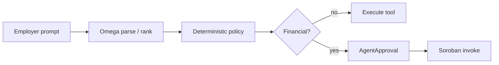

---

## USSD (same live data)

`POST /ussd/callback/` — Flask-style `CON` / `END` body, Django-backed.

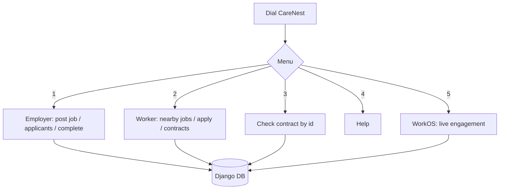

Register in the app first so the phone number matches a user.

---

## Maps and PWA

Workers and employers pin **live** coordinates (`last_lat` / `last_lon`). Job discovery plots **every** live posting; nearby only ranks and highlights. Worker pins are jittered so an exact home is never published.

The UI is an installable PWA (`/manifest.webmanifest`, `/sw.js`, offline page). Android emulator: `http://10.0.2.2:8000`. Bind the server to `0.0.0.0`.

---

## Local run

```bash
cd Care_Nest
python3 -m venv venv
source venv/bin/activate
pip install -r requirements.txt
cp .env.example .env          # set DJANGO_DEBUG=true
python3 manage.py migrate
python3 manage.py seed_workos
python3 manage.py runserver 0.0.0.0:8000
```

Open [http://127.0.0.1:8000](http://127.0.0.1:8000) — password for every demo user is `CareNestDemo1!`

| Role | Email |
| --- | --- |
| Employer | `sarah@carenest.demo` |
| Worker (Mary) | `mary@carenest.demo` |
| Worker | `jane@carenest.demo` |
| Worker | `john@carenest.demo` |

### Guided WorkOS path

1. Sarah → `/wallet/connect/` (Freighter or a testnet `G…` key). Empty `CARENEST_CONTRACT_ID` → labelled **DEMO DATA**.
2. `/agent/` → *“I need a full-time nanny in Westlands, KES 45,000/month.”*
3. Prepare engagement → Command Center: approve **create**, then **fund**.
4. Mary → Engagements → start work → submit.
5. Sarah approves payment once. Mary opens **Work Passport**.

Reload after fund and ask *“What is happening with Mary's contract?”* — the agent answers from `AgentMemory` + ingested events.

---

## Environment

Copy `Care_Nest/.env.example`. Never commit `.env`.

| Variable | Purpose |
| --- | --- |
| `DJANGO_DEBUG` | Local: `true` (LAN / emulator hosts allowed) |
| `DJANGO_SECRET_KEY` | Required in production |
| `DATABASE_URL` | Postgres (Neon). Empty → SQLite |
| `ASI_API_KEY` | Omega/ASI inference — parse/explain only |
| `CARENEST_CONTRACT_ID` | Deployed `C…` id. Empty → DEMO DATA |
| `STELLAR_*_SECRET` | **Testnet only.** Never mainnet. Never logged |
| `CARTO_API_KEY` | Optional [Basemaps](https://carto.com/basemaps/apikey/) raster key (not a platform JWT) |
| `CARENEST_PLATFORM_FEE_PERCENT` | Default `5` |
| `CARENEST_UPSKILLING_RECOVERY_PERCENT` | Default `20` (worker-side) |

---

## Tests

```bash
cd Care_Nest
python3 manage.py test apps.agentic_core
python3 manage.py test apps.wallet.tests.MapTests
```

Soroban (needs Stellar CLI 22+):

```bash
cd Care_Nest/apps/contracts
cargo test
```

---

## Stellar testnet deploy

```bash
cd Care_Nest/apps/contracts
stellar contract build
stellar contract deploy \
  --wasm target/wasm32v1-none/release/carenest_work_contract.wasm \
  --network testnet \
  --source-account <YOUR_TESTNET_SECRET>
stellar contract invoke \
  --id <CONTRACT_ID> \
  --network testnet \
  --source-account <ARBITER_SECRET> \
  -- initialize --arbiter <ARBITER_G_ADDRESS>
```

Set `CARENEST_CONTRACT_ID` and restart. Native XLM SAC on testnet: `CDLZFC3SYJYDZT7K67VZ75HPJVIEUVNIXF47ZG2FB2RMQQVU2HHGCYSC`.

```bash
python3 manage.py ingest_stellar_events
```

Live activity is never labelled demo; demo is never labelled live. If RPC is down, the UI falls back to **DEMO DATA**.

---

## Production notes

- Bind HTTP to `0.0.0.0:$PORT`.
- Filesystem is ephemeral on typical PaaS — use Postgres (`DATABASE_URL`) and object storage for uploads, not local disk.
- Linux paths are case-sensitive.
- Dispute resolution needs `STELLAR_ARBITER_SECRET`. Testnet escrow uses a small XLM amount as a stand-in for a KES stablecoin.

---

## Repo map

```
Care_Nest/
  apps/accounts          roles: worker | employer
  apps/jobs              postings, maps, bilateral terms, images
  apps/contracts         Django contracts + Soroban WorkContract
  apps/wallet            waterfall, M-Pesa, Horizon
  apps/courses           upskilling + recovery balance
  apps/ussd_app          CON/END menus on live DB
  apps/agentic_core      WorkOS agent, memory, Stellar ingest
  templates/ + static/pwa
```
